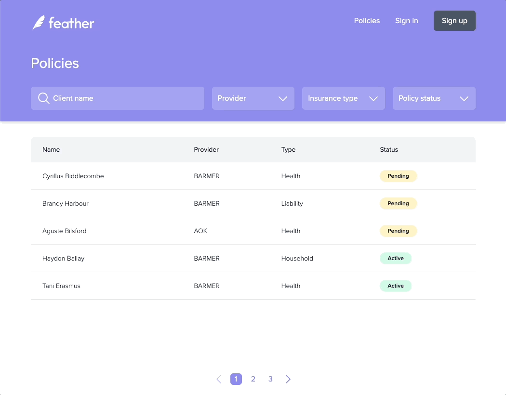

# Feather Take Home Assessment

Thank you for applying at Feather and taking the time to do this home assessment.

The goal of this project is to let you **show off your coding and problem-solving skills**, on a task that resembles the kind of work you’ll be doing with us.

This coding challenge applies to **frontend, backend, and full-stack roles**. Depending on the position you are applying for, you can focus on your specific area.  

You can spend as little or as much time as you like on this project. We've added some initial boilerplate to help you get started, but **feel free to refactor every part of this app as you may seem fit**.

1. Start by reading the [Engineering challenge](#Engineering-challenge) for the position you've applied for and don't forget about the **Acceptance criteria** to have a clear idea of the requirements.
2. Use the [Getting started](#Getting-started) guide to set up a local version of the project on your machine.
3. Take a look at the [Data structure](#Data-structure) and [API](#API) to know what the data looks like.
4. Finish by answering a [couple of questions](#General-questions) about the project. You can answer them on this very same file.

## Engineering challenge

We've prepared several different user stories to work on. Depending on what position you applied to, pick one of them:  
- [Backend](./backend-readme.md)
- [Frontend](./frontend-readme.md)
- [Full Stack](./full-stack-readme.md)


## Task requirements

- Make sure your feature **works as expected**
- Your code is **easy to understand** and follows best practices
- The project **runs with one command,** and without any external configuration
- **Your code has tests** to make sure the functionalities work as expected

## Getting started

1. Make sure you have [Docker](https://www.docker.com/products/docker-desktop/) installed on your machine
2. Set up the environment variables

```bash
cp ./backend/.env.example ./backend/.env
```

3. Build and run the Docker image:

```bash
cd backend
docker-compose build
docker-compose up
```

4. On a new terminal, run the migration and the seed script to add initial data:

```bash
cd backend
docker compose exec backend yarn prisma migrate dev
docker compose exec backend yarn prisma db seed
```

5. That’s it!

You can see the app on `http://localhost:3000`

The API should be running on `http://localhost:4000`

** Note **
If you want to install new dependencies, you'll have to do it inside the docker container. To do that, you can use the following command:

```
docker compose exec {backend OR frontend} yarn add {the_name_of_the_package}
```

Make sure to replace the values between the curly braces `{}` with the correct ones.

## API

After following the [Getting started](#Getting-started) guide, the backend should be running on port `4000`. The backend currently have one endpoint:

| Request type | Path        | Query Params | Example                   |
| ------------ | ----------- | ------------ | ------------------------- |
| `GET`        | `/policies` | `search`     | `/policies?search=BARMER` |

Feel free to update or add more endpoints to accommodate or improve your solution.

## Data structure

### Policy

| fields         | type                            | comment                                       |
| -------------- | ------------------------------- | --------------------------------------------- |
| id             | string                          | Used to identify the policy                   |
| customer       | [Customer](#Customer)           | Object holding the customer's informations    |
| provider       | string                          | Name of the provider (Allianz, AXA…)          |
| insuranceType  | [InsuranceType](#InsuranceType) | Type of the insurance (Liability, Household…) |
| status         | [PolicyStatus](#PolicyStatus)   | Status of the insurance (Active, Cancelled)   |
| startDate      | date                            | Date when the policy should start             |
| endDate        | date                            | Date when the policy ends                     |
| createdAt      | date                            | Date when the record was created              |

### Customer

| fields      | type   | comment                       |
| ----------- | ------ | ----------------------------- |
| id          | uuid   | Used to identify the customer |
| firstName   | string | Customer’s first name         |
| lastName    | string | Customer’s last name          |
| dateOfBirth | date   | Customer’s date of birth      |

### InsuranceType

`InsuranceType` can be of `LIABILITY`, `HOUSEHOLD`, `HEALTH`

### PolicyStatus

`PolicyStatus` can be of `ACTIVE`, `PENDING`, `CANCELLED` and `DROPPED_OUT`

## General questions

- How much time did you spend working on the solution?  
  - About 4 days
- What’s the part of the solution you are most proud of?

  - I'm glad I was able to make all the components in the `components` directory decoupled from one another. This makes these components reusable and testable.
  - Making the filters work smoothly was challenging. I solved it by having a `filters` object and encapsulating the filtering policy in a function (`filterPolicies`). This way I could easily pass the function into all of the handlers of the filter components.

- If you had more time, what other things you would like to do?  
  I would do the following:
    - Write unit tests for the utility functions and reusable components.
    - Implement path aliases.
    - Improve the `Pagination` component to deal with large number of rows.
    - Create a separate API class for the Policy API
- Do you have any feedback regarding this coding challenge?  
    - It's both fun and challeging especially if you're not familliar with creating components from scratch (e.g. `Table`, filter components, & `Pagination`).

  _Is the initial setup working?, is something missing?, or any other comment_

## Demo

